# RoboCompanion v2

Telegram-бот-CRM для операторов, сопровождающих клиентов трейдинг-сервиса от первого
контакта до перевода на реальный счёт. База клиентов хранится в Google Sheets —
привычный интерфейс для менеджера, без отдельной админки.

## Бизнес-сценарий

1. Менеджер сообщает оператору данные нового клиента (имя, депозит, терминал).
2. Оператор запускает диалог `/new` — бот пошагово запрашивает контакт, опыт,
   терминал, депозит, способ торговли и создаёт карточку клиента на этапе 1.
3. Бот сам напоминает о задачах дня (`/today` + ежедневная авто-рассылка
   операторам) и предлагает готовый шаблон сообщения с подстановкой имени и
   депозита клиента.
4. Оператор отправляет клиенту шаблон, отмечает контакт — бот переводит
   карточку на следующий этап и стартует таймер следующего напоминания.
5. Клиент проходит 7 этапов сопровождения: материалы → ознакомление → запуск
   робота → понимание логики → риск-контроль → тестирование → недельные итоги.
6. На финальном этапе бот собирает сводку по клиенту (`/complete`) для
   передачи менеджеру.
7. После перехода клиента на реальный счёт — `/activate` добавляет его в
   список рассылки; `/broadcast` позволяет разослать сообщение выбранным
   клиентам вручную, с чекбоксами и отчётом о доставке.

## Скриншоты

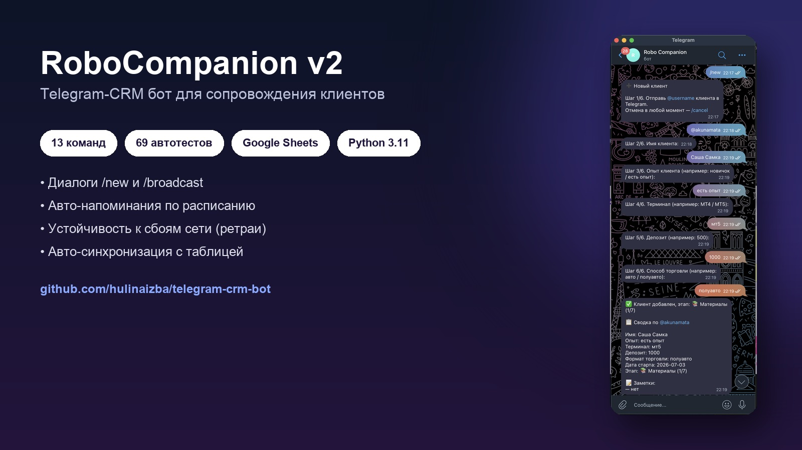

<table>
<tr>
<td>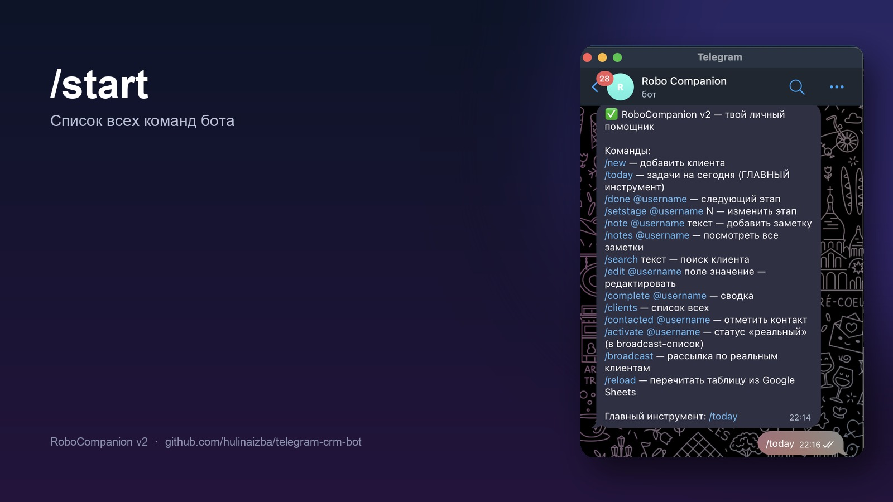<br><sub>/start — список команд</sub></td>
<td>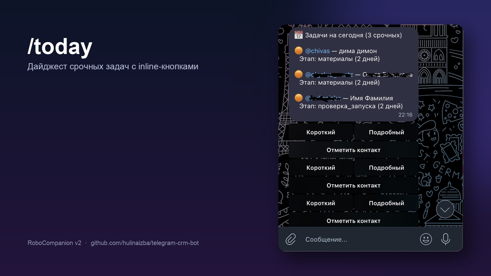<br><sub>/today — дайджест задач</sub></td>
<td>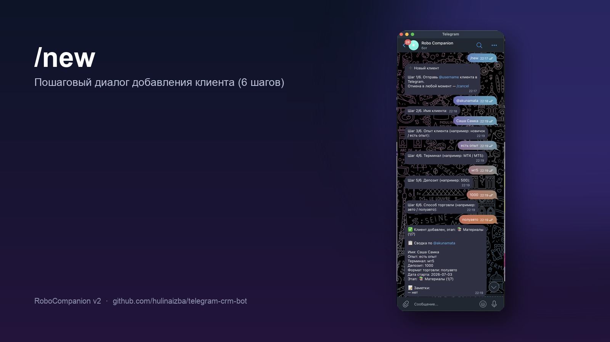<br><sub>/new — добавление клиента</sub></td>
</tr>
<tr>
<td>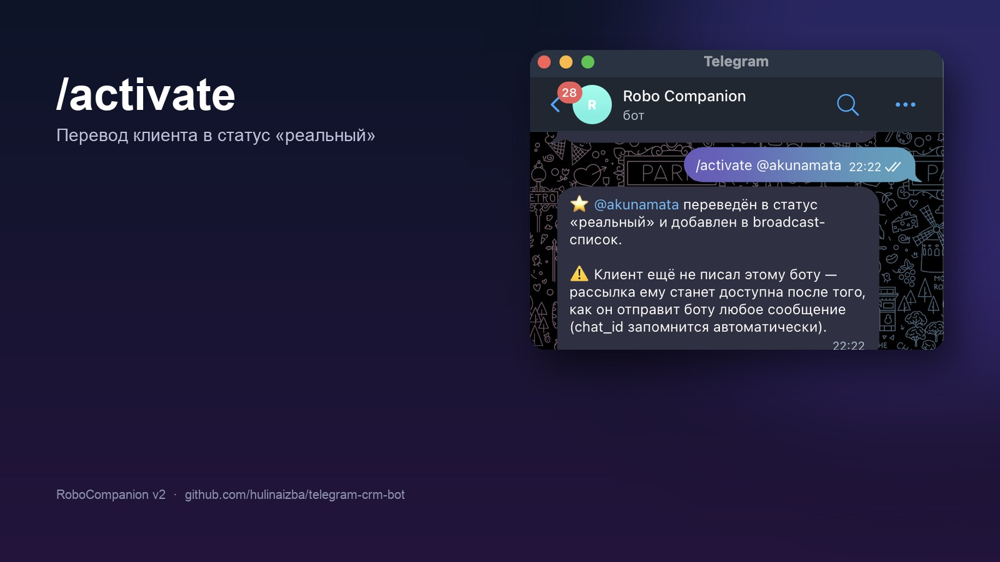<br><sub>/activate — активация клиента</sub></td>
<td>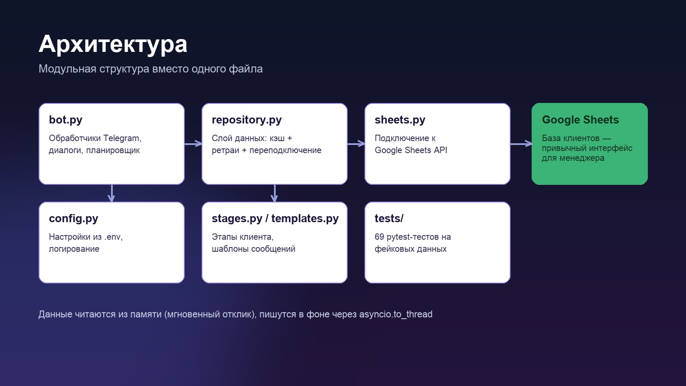<br><sub>Архитектура проекта</sub></td>
<td>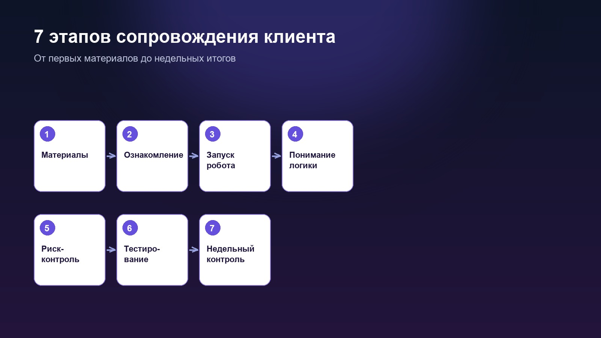<br><sub>7 этапов сопровождения</sub></td>
</tr>
<tr>
<td>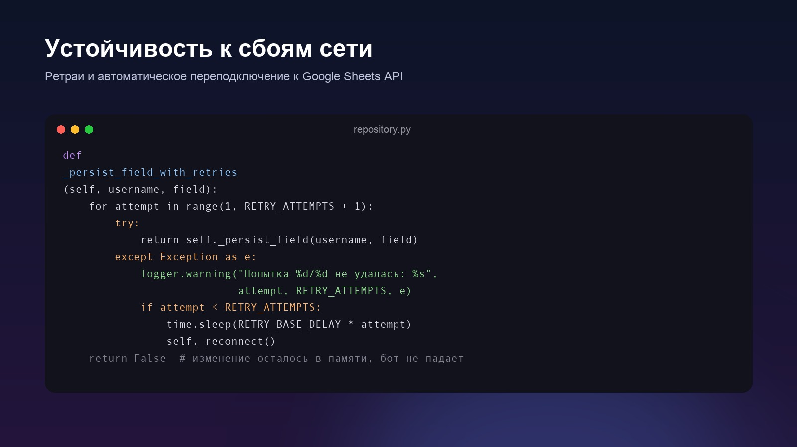<br><sub>Ретраи и переподключение</sub></td>
<td>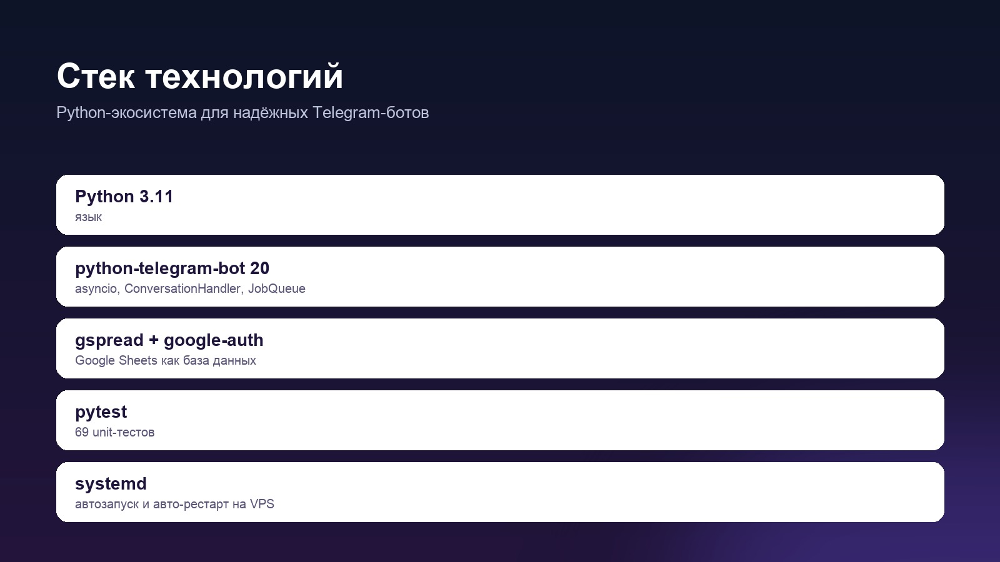<br><sub>Стек технологий</sub></td>
<td>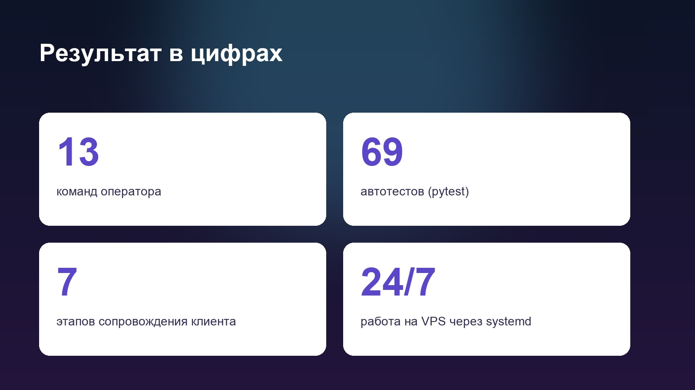<br><sub>Результат в цифрах</sub></td>
</tr>
<tr>
<td>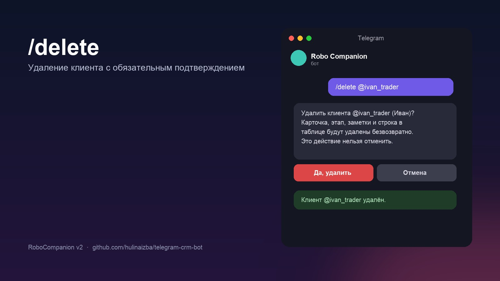<br><sub>/delete — удаление с подтверждением</sub></td>
</tr>
</table>

## Возможности

| Команда | Назначение |
|---|---|
| `/new` | Пошаговое добавление клиента (диалог) |
| `/today` | Дайджест срочных задач с inline-кнопками |
| `/done @username` | Перевод на следующий этап |
| `/setstage @username N` | Установка конкретного этапа |
| `/note` / `/notes` | Заметки по клиенту |
| `/search` | Поиск по имени/username/заметкам |
| `/edit` | Редактирование полей карточки |
| `/complete` | Сводка по клиенту для менеджера |
| `/clients` | Список всех клиентов |
| `/contacted` | Отметка контакта |
| `/activate` | Перевод в статус «реальный» (broadcast-список) |
| `/broadcast` | Рассылка выбранным клиентам с подтверждением |
| `/reload` | Перечитать таблицу вручную |
| `/delete @username` | Удалить клиента (с подтверждением) |
| `/idea текст` | Записать идею по улучшению бота на будущее |
| `/ideas` | Показать последние записанные идеи |

Плюс автоматика: ежедневное напоминание операторам по расписанию,
периодическое авто-перечитывание таблицы (правки менеджера подхватываются
без перезапуска), автозапоминание chat_id клиентов при первом сообщении боту.

### Журнал идей

`/idea` и `/ideas` — лёгкий механизм для операторов копить предложения по
развитию бота прямо в Telegram, без переключения в другие инструменты.
Идеи пишутся в отдельный лист «Идеи» той же Google-таблицы (создаётся
автоматически при первом использовании) и остаются там для последующей
реализации разработчиком.

## Архитектура

```
bot.py         — обработчики Telegram (команды, диалоги, кнопки, планировщик)
config.py      — конфигурация из .env, логирование с ротацией
repository.py  — слой данных: кэш в памяти + синхронизация с Google Sheets
                 (ретраи, переподключение, устойчивость к сбоям API)
sheets.py      — подключение к Google Sheets API
stages.py      — модель этапов сопровождения
templates.py   — шаблоны сообщений с подстановкой {name}/{deposit}
ideas.py       — журнал идей операторов (/idea, /ideas), отдельный лист таблицы
tests/         — pytest, 95 тестов на фейковой таблице и фейковых Update
deploy/        — systemd-юнит и инструкция по деплою на VPS
```

Данные читаются из памяти (мгновенный отклик бота), а изменения пишутся в
Google Sheets в фоне через `asyncio.to_thread`, с ретраями и автоматическим
переподключением при сбоях API — падение сети не роняет бота.

## Стек

- Python 3.11, [python-telegram-bot](https://github.com/python-telegram-bot/python-telegram-bot) 20 (asyncio, `ConversationHandler`, `JobQueue`)
- [gspread](https://github.com/burnash/gspread) + `google-auth` — Google Sheets как база данных
- `pytest` — 95 unit-тестов без обращения к реальным Telegram/Google API

## Установка

```bash
git clone <URL_РЕПОЗИТОРИЯ>
cd robo_companion_v2
python3 -m venv venv
venv/bin/pip install -r requirements.txt
cp .env.example .env   # заполнить своими значениями
```

### Настройка Google Sheets

1. Создайте проект в [Google Cloud Console](https://console.cloud.google.com/),
   включите Google Sheets API.
2. Создайте сервисный аккаунт, скачайте JSON-ключ, укажите путь к нему в
   `GOOGLE_CREDENTIALS_FILE`.
3. Откройте доступ к таблице для email сервисного аккаунта (роль «Редактор»).
4. Создайте лист (по умолчанию `Клиенты`) с заголовками первой строки:
   `username, имя, опыт, терминал, депозит, формат_торговли, текущий_этап,
   заметки, дата_старта, последний_контакт, статус, chat_id`.

### Настройка Telegram

1. Получите токен бота у [@BotFather](https://t.me/BotFather), укажите в `BOT_TOKEN`.
2. Узнайте свой `user_id` у [@userinfobot](https://t.me/userinfobot), укажите
   в `ALLOWED_USERS` (через запятую для нескольких операторов).

### Запуск

```bash
venv/bin/python bot.py
```

## Тесты

```bash
venv/bin/pip install -r requirements-dev.txt
venv/bin/python -m pytest tests/
```

## Автозапуск

- **На Mac (пока разрабатываем/тестируем)** — через `launchd`, работает без
  открытого Terminal, пока компьютер включён: [`deploy/mac/AUTOSTART.md`](deploy/mac/AUTOSTART.md).
- **На VPS (продакшен, 24/7)** — заказ сервера, перенос, автозапуск через
  systemd: [`deploy/DEPLOY.md`](deploy/DEPLOY.md).

## Лицензия

© 2026, все права защищены. Код опубликован в демонстрационных целях
(портфолио) — просмотр разрешён, использование, копирование и
распространение без разрешения автора запрещены. Подробности —
в [`LICENSE`](LICENSE).
